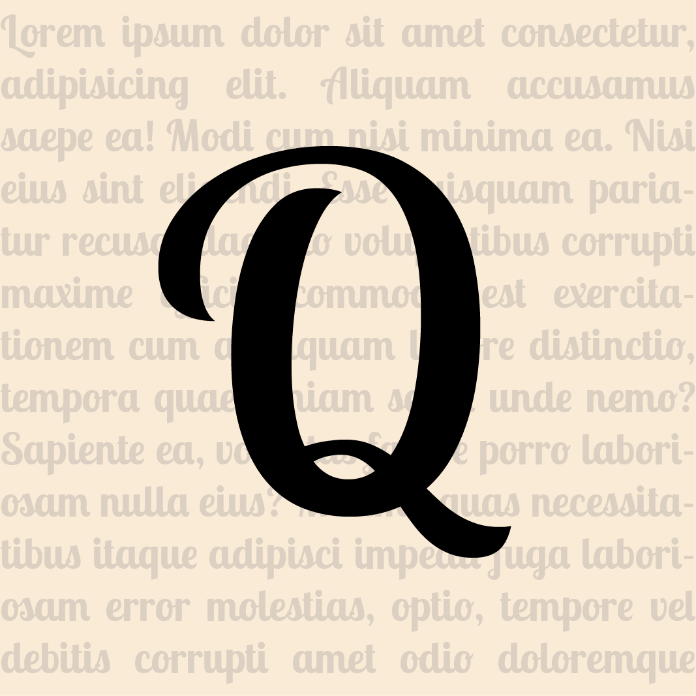

  
  <h1>Quippy</h1>  
  
Reflective Quips & Quotes

  
  

  </h2>Why?</h2>
  

    2022 has been a struggle. This project is a reaction to that.
  

  

    I have always enjoyed reading inspirational and uplifting quotes. I know from experience how a few carefully curated words can transform your mindset. Accordingly, as a passion project, I began traversing the internet, collating thought-provoking quotes and presenting them in a minimalistic, calming style.
  
  
  

    First and foremost, this app was developed for personal use. I've been intentional in the design to create an experience that _I_ enjoyed. My hope is that others may discover that the product helps them to feel more relaxed and inspired.
  

  

    After reading _Start With Why_ by Simon Sinek and reflecting on the content, I've come to realise that my purpose in life is to _create those small moments of joy for others_ through my work, my social interactions, the people I mentor, the products I build and the services I provide. Quippy is just one channel through which I hope to deliver my <em>'why'</em>.
  

  

    I wish everyone a prosperous and healthy 2023.
  

  

    Happy New Year.
  

